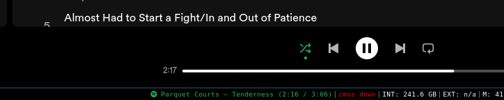

# py3spotifystatus - Spotify widget for py3status bar for i3 window manager



- [About](#about)
- [Requirements](#requirements)
- [Installation](#installation)
- [Configuration](#configuration)
- [Examples](#examples)
- [Changes in this version](#changes-in-this-version)
- [Credits](#credits)

This is a widget for the py3status for i3 which displays the current Spotify song and artist, and the current progress through the song.

This is an updated verison of [rpieja's i3spotifystatus](https://github.com/rpieja/i3spotifystatus) (unmaintained since 2018). Bug reports and pull requests are welcome! I will attempt to respond as soon as possible.

## Requirements

* [py3status](https://py3status.readthedocs.io/en/latest/user-guide/installation/)
* [Spotify desktop app](https://www.spotify.com/us/download/linux/) - web player is not enough
* (optional) [FontAwesome for the desktop](https://fontawesome.com/download) if you want Spotify logo in status bar

The other requirements are dbus and Python 3, which you shouldn't need to worry about since they come bundled with most distros. You also need [i3](https://i3wm.org), obviously.

## Installation

* Clone repository to your preferred location
* Update your `i3status.conf` with
```conf
order += "external_script"

# ...

external_script {
    script_path = "/path/to/i3spotifystatus/pystatus.py"
    cache_timeout = 1
}
```
* (optional) keybindings can be added through i3 `config` file, e.g.
```
bindsym $mod+$alt+D exec /path/to/i3spotifystatus/sendCommand.sh playpause
# etc.
```

## Configuration

There are some options you can set at the top of the `pystatus.py` script by editing it. They are documented in the script.

## Examples

Widget with all config options on, while playing:


While paused (and demonstrating non-latin song titles):


Showing truncation of long song titles:


With song progress turned off:


## Changes in this version

In this version I:

* Added song progress to widget
* Added podcast support
* Added `sendCommand.sh` script, which can be used to remotely control the Spotify player, for example using i3 mod keybindings
* Changed output format of `pystatus.py` to work with py3status
* Updated colours to match current Spotify branding
* Fixed multiple bugs

## Credits

[Original i3spotifystatus](https://github.com/rpieja/i3spotifystatus) by [rpieja](https://github.com/rpieja).

Original credits:

>Script is based on sample wrapper commited on original i3status repository.
>
>Awk script by @csssuf.

